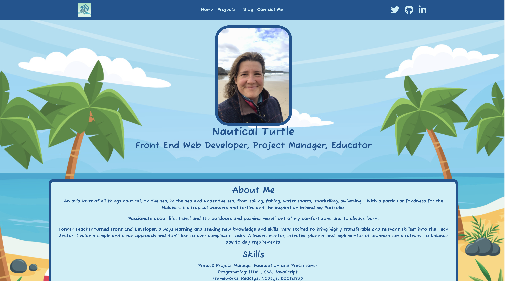
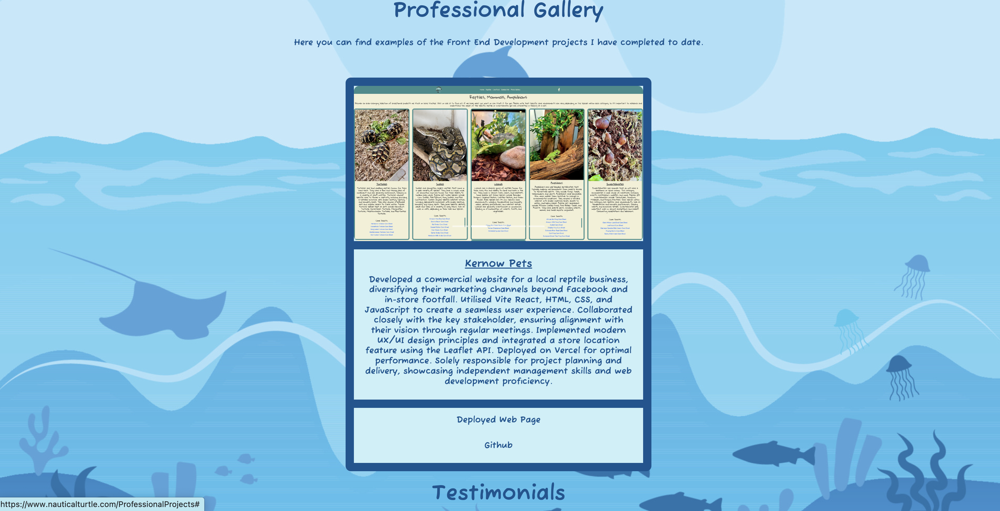
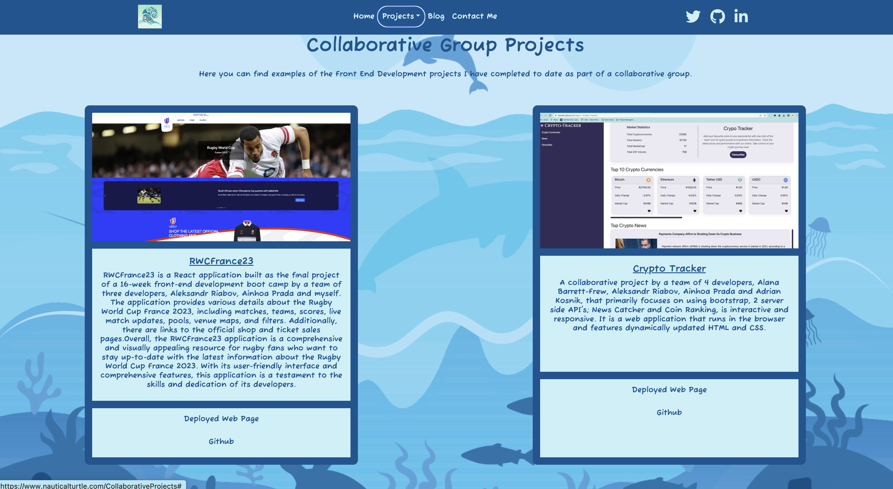
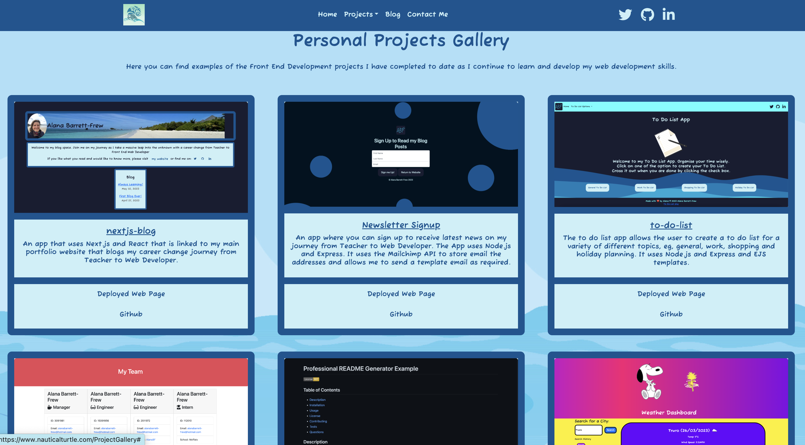
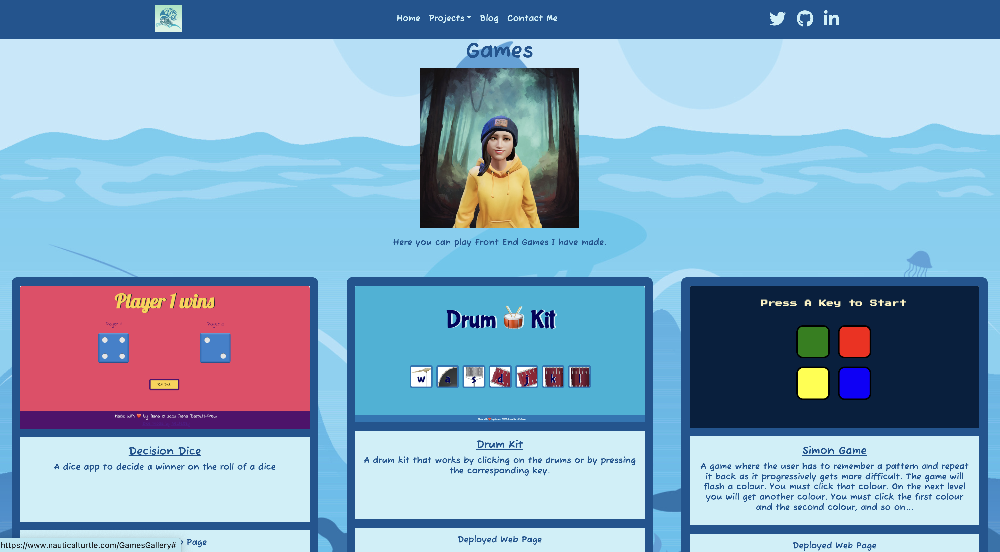
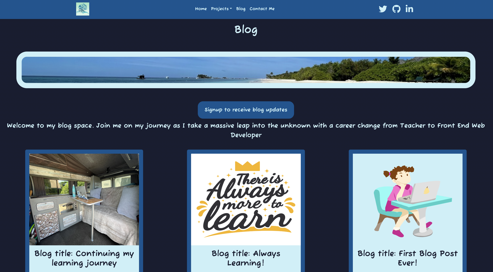
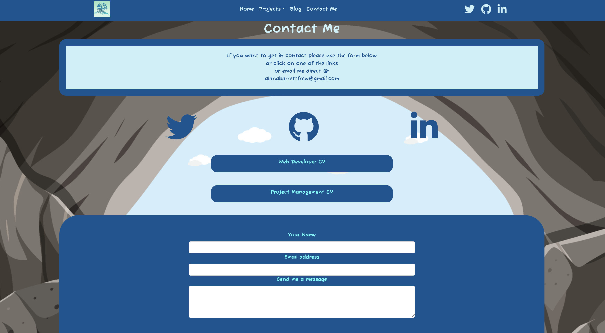

# Portfolio

This repository contains the code for my Portfolio Site, which showcases my projects so far. The site is built using HTML, CSS, JavaScript, and React.

Website: [Portfolio](https://alanabarrettfrew.com)

[](https://opensource.org/licenses/MIT)
## Table of Contents

- [Portfolio](#portfolio)
  - [Table of Contents](#table-of-contents)
  - [Technology Used](#technology-used)
  - [Description](#description)
  - [Front-end Web Development](#front-end-web-development)
  - [Screenshots](#screenshots)
  - [Contributing](#contributing)
  - [License](#license)
  - [Questions](#questions)

## Technology Used

The portfolio website is built using the following technologies:

- 
- 
- 
- 
- 

## Description

The portfolio is designed to showcase my projects. The website incorporates HTML, CSS, and JavaScript for the front-end development, with React and React Bootstrap to enhance the user experience. You can use this website to explore my services, view my past/current projects, and get in touch with me. The website provides an intuitive interface and easy navigation to help you find the information you need.

## Front-end Web Development

The front-end web development of the site highlights my expertise and portfolio of projects in creating visually appealing and functional websites. The site demonstrates the use of modern web technologies, including React, to deliver engaging user experiences.

To explore the front-end web development services, please follow the instructions below:

- Make sure you have Node.js installed on your machine.
- Clone this repository to your local machine.
- Open a terminal and navigate to the project directory.
- Run the following command to install the dependencies:

```npm install```

- After the installation is complete, start the development server with the following command:

```npm run dev```

- Open your browser and visit http://localhost:5173 to view the Portfolio Site.

Feel free to navigate through the different sections and explore the showcased projects. If you have any questions or inquiries regarding front-end web development, please don't hesitate to contact me.

## Screenshots









## Contributing

A am not currently accepting contributions to this project. However, if you have any suggestions or feedback, please feel free to contact me.

## License

*This project is licensed under* [MIT](https://choosealicense.com/licenses/mit/)

## Questions

Thank you for visiting my Portfolio Site. I look forward to hearing from you. If you have any questions or need further assistance, please contact me:

- Email: [alanabarrettfrew@gmail.com](mailto:alanabarrettfrew@gmail.com)
- Phone: 07817663239
- Website: [www.alanabarrettfrew.com](https://www.alanabarrettfrew.com)
- Github: [AlanaBF](https://github.com/AlanaBF)
